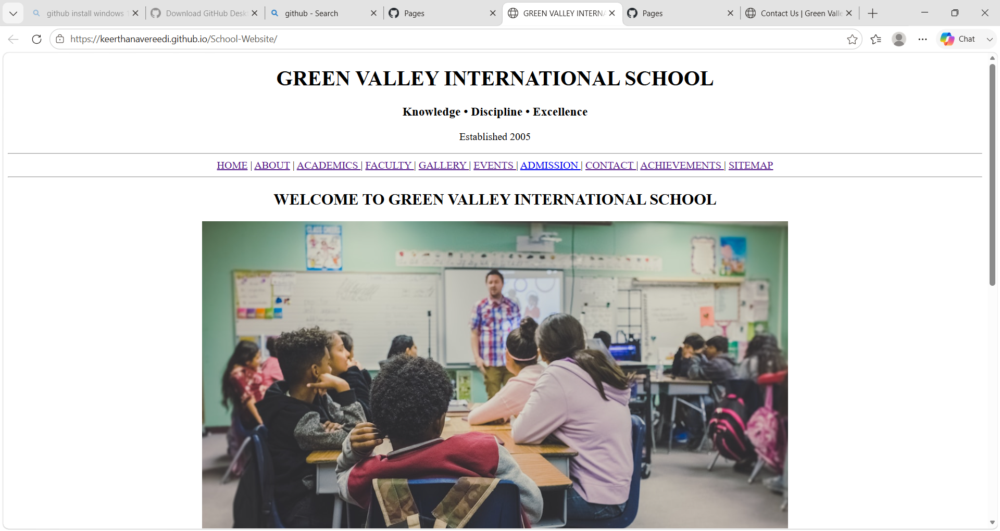

## Preview

# School Website

A structured school website developed using HTML5 to create a clean and informative online presence for an educational institution.

## Features

- Home page
- About section
- Academics information
- Faculty details
- Achievements section
- Events section
- Gallery section
- Contact page
- Sitemap navigation

## Technologies Used

- HTML5

## Project Purpose

This project was developed to understand HTML fundamentals, webpage structure, navigation, and organizing content for a complete website.

## Future Improvements

- Add CSS for modern UI design
- Make the website fully responsive
- Add JavaScript interactions
- Improve user experience
